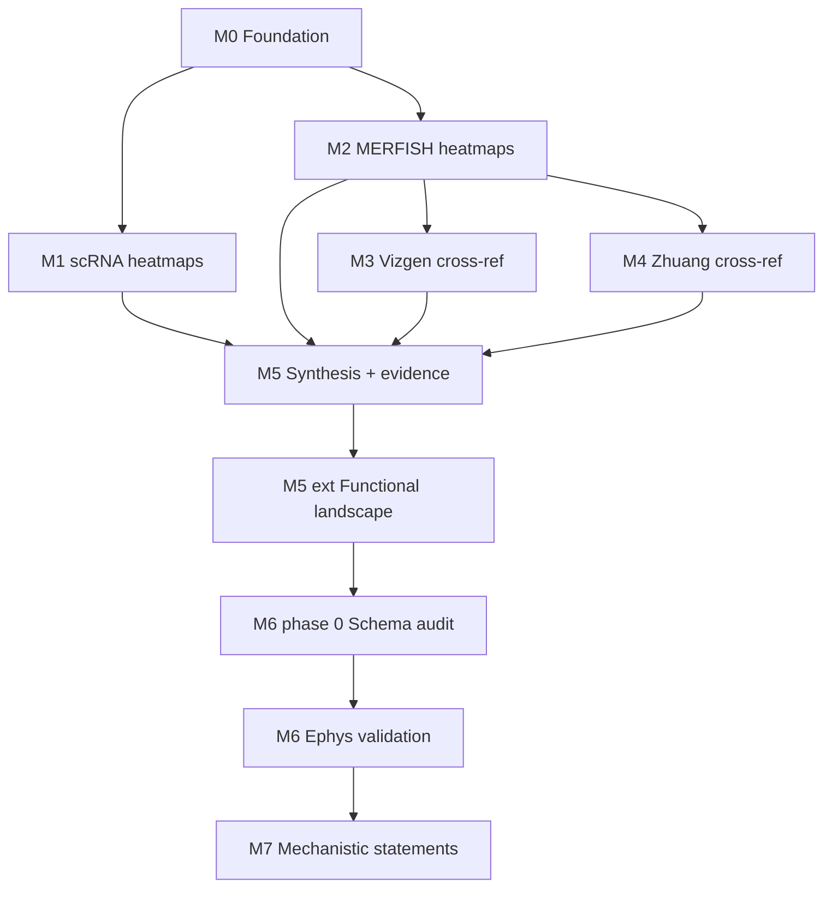

# Expresso — milestones & roadmap

Living map of what has been built, what is in active use, and what comes next.
Last updated: June 2026.

---

## North star

Use openly available transcriptomic and spatial datasets (Allen scRNA, Allen MERFISH,
Vizgen, Zhuang) within the Allen CCF + cell-type taxonomy to **cross-validate**
expression of a curated receptor + excitability gene panel, then support
**functional statements** of the form:

> *Cell type C in region R expresses gene set X, implying intrinsic excitability
> profile … and neuromodulatory influences …*

with explicit confidence tiers, provenance (measured vs imputed), and — in later
milestones — validation against **single-cell electrophysiology**.

Companion references: [`receptor_excitability.md`](receptor_excitability.md),
[`excitability_genes.md`](excitability_genes.md), [`REVIEW.md`](REVIEW.md).

---

## Completed milestones

### M0 — Foundation ✅

| Deliverable | Location |
|-------------|----------|
| Unified config loader | `src/config.py`, `query_config.yaml` |
| ABC Atlas data access (backed h5ad, partial reads) | `src/data_loaders.py` |
| Plotting (heatmaps, cross-ref scatters) | `src/plotting.py` |
| Run folders + git/config manifest | `start_run()`, `run_manifest.json` |
| Smoke test | `scripts/verify_setup.py` |
| Repo guide | `REPOSITORY_GUIDE.md` |

**Key design choices:** config-driven genes/regions; timestamped runs outside the
repo; memory-safe MERFISH imputed reads; nested `gene_panel` (category → family → genes).

---

### M1 — Allen scRNA heatmaps ✅

**Notebook:** `notebooks/01_scrna_heatmaps.ipynb`

- Mean log2(CPM+1) per cell type × brain area (pooled VIS dissection ROIs)
- Per-family and combined heatmaps
- Output: `aggregated_scrna.parquet` (`mean_expression`, `frac_expressing`, `n_cells`)

**Limitation (by design):** scRNA cannot resolve VISp vs VISpm; fine-region claims
require spatial datasets (M2–M4).

---

### M2 — Allen MERFISH heatmaps ✅

**Notebook:** `notebooks/02_merfish_spatial.ipynb`

- Native CCF sub-region resolution (VISp, VISpm, VISam, RSPagl, …)
- Measured ~500-gene panel + optional **imputed** ~8k matrix (`use_imputed_merfish`)
- Output: `aggregated_merfish.parquet`
- **Fix (2026-06):** row-first h5ad slice for imputed matrix (avoids multi-hour hangs on 47 GB file)

---

### M3 — Vizgen cross-reference ✅

**Notebook:** `notebooks/03_vizgen_crossref.ipynb`

- kNN label transfer (z-scored) from Allen MERFISH → Vizgen cells
- Spearman-first concordance vs Allen; measured-only metrics
- Full-library CPM normalization (not receptor-subset denominator)
- Output: `aggregated_vizgen.parquet`, cross-ref figures
- **Depends on:** M2 `aggregated_merfish.parquet` for label transfer

---

### M4 — Zhuang cross-reference ✅

**Notebook:** `notebooks/04_zhuang_crossref.ipynb`

- Replicate-averaged Zhuang MERFISH (~1,122 genes)
- Spearman concordance vs Allen MERFISH
- Output: `aggregated_zhuang.parquet`, cross-ref figures
- **Depends on:** M2 for Allen reference aggregates

---

### M5 — Cross-dataset synthesis ✅

**Notebook:** `notebooks/05_synthesis.ipynb`  
**Module:** `src/synthesis.py`

| Step | What it does |
|------|----------------|
| Aggregate discovery | Auto-find newest `aggregated_*.parquet` per dataset from run folder names |
| Evidence table | One row per `(cell_type, brain_area, gene)` with per-dataset means, detection, provenance |
| Confidence tiers | **High** = ≥2 independent measured datasets; **medium** = 1 measured (+ imputed support); **low/none** otherwise |
| Independence model | Allen MERFISH imputed values are *supporting only* (not independent of scRNA) |
| Target reports | Batch export under `targets/{cell_type}__{region}/` (CSVs, statement, family PDF) |
| Global outputs | `evidence_table.parquet` / `.csv`, `targets/_index.csv` |

**Run order:** M1 + M2 in parallel → M3 + M4 (need M2) → M5 (needs all four aggregates).

---

### M5 extension — Functional landscape ✅ *(implemented inside notebook 05)*

**Module:** `src/functional_analysis.py`  
**Config:** `functional_analysis:` block in `query_config.yaml`

Goes beyond inventory to **mechanism-oriented grouping**:

| Feature | Description |
|---------|-------------|
| Functional modules | Resonance axes (H-resonance, M-resonance, INaP amplifier, …) + coupling-centric neuromodulator axes (Gi/Gq/Gs) |
| Targets | `(cell_type, brain_area)` at **`config.cell_type_level`** — same evidence table as synthesis (no separate level override) |
| Region rollups | Synthetic **V2M** (unweighted mean) and **V2M_wt** (cell-count weighted) from VISpm + VISam + RSPagl; tiers recomputed |
| Three analysis views | **CCF** (4 parcels) · **VISp+V2M** · **VISp+V2M_wt** — separate module/gene heatmaps, clustering, PCA, exports |
| Expression picker | Spatial priority: MERFISH → Vizgen → Zhuang → scRNA; high/medium tier only |
| Module scores | Z-scored gene means per module per target (recomputed within each view) |
| VISp vs V2M contrast | From CCF view: V2M − VISp module-score deltas (`functional/ccf/vis_group_contrast.csv`) |
| Ephys link (M5) | Cohort summaries per atlas target; CCF `brain_area` preferred when present in ephys CSV |

**Outputs:** `{run_dir}/functional/{ccf,visp_v2m,visp_v2m_weighted}/` — parquets, module + expression heatmaps, dendrogram, embedding PDFs, ephys link table.

**Test fixture:** [`data/test_experimental_resonance.csv`](data/test_experimental_resonance.csv) — schema demo only; replace for M6.

---

## Operational state (June 2026)

- **Single taxonomy level:** `cell_type_level` in `query_config.yaml` drives notebooks 01–05, synthesis reports, and functional landscape. Re-run 01–04 at the chosen level before M5.
- **Exploration folder** may contain runs at multiple levels; M5 discovers the newest parquet matching `config.cell_type_level` per dataset.
- **Functional landscape** reuses the synthesis `evidence` table (including V2M rollups) — no second parquet load.

**Typical M5 run:**

1. Run 01–04 at desired level (e.g. subclass or supertype).
2. Run notebook 05 through functional cells.
3. Compare `functional/ccf/` vs `functional/visp_v2m/` — row counts and brain areas should differ.
4. Inspect `vis_group_contrast.csv` and L5 IT vs L5 ET module separation in the VISp+V2M view.

---

## Future milestones

### M6 — Ephys ↔ expression validation *(next — awaiting QC re-upload)*

**Goal:** Close the loop between **single-cell resonance recordings** and
**pseudobulk expression module scores** — including subclusters *within* broad types
(e.g. functional subgroups inside L5 ET).

**Real data (control):**
`/Users/rancze/Documents/Data/expresso_data/physiology/restructured/control_excitability.csv`
— 100 cells × 87 columns. Schema audit: `scripts/audit_ephys_schema.py`.

**Status:** Phase 0 audit complete; design decisions locked below. **Implementation
blocked on QC pass** — user re-uploading curated CSV from parallel QC workflow.

#### Schema audit summary (June 2026)

| Finding | Implication |
|---------|-------------|
| **No Allen taxonomy columns** | Join at **coarse_type** (derived), not supertype/cluster |
| **`region`:** V1 (28), V2M (72) | Primary area key → `brain_area_group` |
| **`layer`:** L5 (73), L2-3 (27) | L2/3 IT from layer; L5 needs `assumed_type` or untyped pool |
| **`assumed_type`:** ET (17), Tlx (9), empty (74) | Only on V2M L5; ET/Tlx are typed L5 |
| **`area_morph`:** sparse (19 L5 V2M) | Optional CCF match (VISpm, VISam, …) when populated |
| **Resonance:** `_chirp__Res. freq. (Hz)`, `_chirp__Res. imp. mag. (MOhm)` | Map to `peak_resonance_hz`, `resonance_strength` |
| **`exclude_flag`:** 0 / ? / NaN | See QC rules below |

#### Locked design decisions

| # | Topic | Decision |
|---|-------|----------|
| 1 | Allen depth | **Coarse only** — derive `coarse_type` from `layer` + `assumed_type`; pseudobulk at `config.cell_type_level` filtered by coarse bucket |
| 2 | Area | **`V1` → VISp**, **`V2M` → V2M**; optional `brain_area` from `area_morph` when present |
| 3 | Expression | **Pseudobulk** module scores from `functional/visp_v2m/` — no single-cell MERFISH |
| 4 | Type labels | **`ET` → L5 ET**, **`Tlx` → L5 IT** |
| 5 | `exclude_flag` NaN | **Include** (treat as pass) |
| 6 | `res_freq == 0` | **Include** — no resonance in 0.5–50 Hz band; meaningful contrast cluster |
| 7 | `source_sheet` | **Keep all rows** (no sheet filter) |
| 8 | **M6 v1 scope** | **V2M × L5 ET only** (~16 cells with `assumed_type=ET`, `region=V2M`, `layer=L5`) |
| 9 | Before M6 done | **Extend** to other cohorts (L5 IT/Tlx, L2/3, VISp, untyped L5) — see open item below |

#### Open before implementation

| Item | Owner | Notes |
|------|-------|-------|
| **Untyped L5** (~43 usable cells) | User | Include as pool, split by morphology, or exclude? **Remind at start of M6 coding step.** |
| **QC re-upload** | User | Replace/adjust CSV after parallel QC; may update exclude rules and outlier list |
| **`exclude_flag == ?`** | TBD after QC | Currently 7 cells; confirm with QC output |

#### Column mapping (control CSV → Expresso)

| Expresso | Source column | Rule |
|----------|---------------|------|
| `cell_id` | `cell_id` | |
| `brain_area_group` | `region` | V1→VISp, V2M→V2M |
| `brain_area` | `area_morph` | Normalize (`VISpm/ RSPagl` → split or first parcel); empty→NaN |
| `coarse_type` | `layer`, `assumed_type` | L2-3→L2/3 IT; ET→L5 ET; Tlx→L5 IT; L5 untyped→pending |
| `peak_resonance_hz` | `_chirp__Res. freq. (Hz)` | Keep 0; exclude only clear failures (e.g. −73 Hz) per QC |
| `resonance_strength` | `_chirp__Res. imp. mag. (MOhm)` | |
| `exclude` | `exclude_flag`, `excluded_in_May` | Exclude if `1` or `excluded_in_May`; NaN flag→include |

**Config:** `functional_analysis.experimental_resonance_csv` → path to QC'd CSV.

#### M6 phases *(after QC re-upload)*

| Phase | Task | Notes |
|-------|------|-------|
| **0b — QC ingest** | Load QC'd CSV; apply mapping; validate cohort counts | User re-upload |
| **1 — Adapter** | `load_control_excitability()` → standard Expresso ephys frame | Preserve raw columns in sidecar |
| **2 — Ephys clustering** | **V2M L5 ET** on res freq + imp mag (+ optional features) | Include res_freq=0 cluster |
| **3 — Pseudobulk join** | Correlate subclusters with L5-ET-like targets × V2M module scores | Spearman / regression |
| **4 — Extend cohorts** | L5 IT, L2/3, VISp, untyped L5 (after untyped decision) | Required before M6 ✅ |

**Deliverables:**

- `src/ephys_validation.py` (or extend `functional_analysis.py`)
- Notebook `06_ephys_validation.ipynb` or M5 extension cells
- `{run_dir}/ephys/` — subcluster labels, correlation tables, figures

---

### M7 — Mechanistic coupling statements *(optional)*

**Goal:** Move from module scores to **pathway-level claims** grounded in
`receptor_excitability.md` (e.g. α2-AR → HCN suppression, M1 → M-current collapse).

| Task | Notes |
|------|-------|
| Effector-chain scoring | Gi receptor module × GIRK/HCN effector module concordance |
| Presynaptic vs postsynaptic | Split receptor tables by compartment where literature supports it |
| Area-specific neuromodulation | VISp vs V2M contrasts on coupling axes |
| Tier weighting | Lift PROMINENT/PLAUSIBLE from `excitability_genes.md` into YAML for prioritization ([REVIEW §3.2 open item]) |

---

### M8 — Reporting & scale *(optional)*

| Task | Notes |
|------|-------|
| Master report PDF | Cross-target summary beyond per-target family PDFs |
| Spatial map revival | Wire `plot_spatial` / `plot_family_spatial_panel` if slice-level figures needed |
| Performance | Cache imputed MERFISH row-slices per cell filter; parallel target export |
| Taxonomy guard | Assert non-empty joins in cross-ref ([REVIEW §5 open item]) |

---

## Open items (from review, not yet scheduled)

| Item | Severity | Ref |
|------|----------|-----|
| PROMINENT/PLAUSIBLE gene tiers in YAML | Enhancement | REVIEW §3.2 |
| `plot_spatial` unused by notebooks | Low | REVIEW §5 |
| Cross-ref taxonomy overlap assertion | Low | REVIEW §5 |
| `top_variable_cell_types` unused | Low | REVIEW §5 |

---

## Milestone dependency graph

---

## Quick reference — key artifacts

| Artifact | Milestone | Path pattern |
|----------|-----------|--------------|
| `aggregated_scrna.parquet` | M1 | `{timestamp}_{level}_WMB-10Xv3/` |
| `aggregated_merfish.parquet` | M2 | `{timestamp}_{level}_MERFISH-*/` |
| `aggregated_vizgen.parquet` | M3 | `{timestamp}_{level}_Vizgen-MERFISH/` |
| `aggregated_zhuang.parquet` | M4 | `{timestamp}_{level}_Zhuang-ABCA/` |
| `evidence_table.parquet` | M5 | `{timestamp}_{level}_synthesis/` |
| `targets/` report tree | M5 | `.../synthesis/targets/` |
| `functional/` landscape | M5 ext | `.../synthesis/functional/{ccf,visp_v2m,visp_v2m_weighted}/` |
| Ephys CSV | M6 | `functional_analysis.experimental_resonance_csv` (real data) |
| Ephys schema demo | M6 prep | `data/test_experimental_resonance.csv` |

Run folder naming: `{YYYYMMDD}_{HHMMSS}_{cell_type_level}_{dataset_slug}` under
`output.output_dir`.

---

## Where we are / where we are going

**Done:** M0–M5 including functional landscape (three region views, V2M rollups,
unified `cell_type_level`). Cross-validated evidence, per-target reports, module
scores, and ephys cohort linking at the M5 level.

**Now (M6):** Phase 0 audit done on `control_excitability.csv`; design locked for
V2M L5 ET v1. **Waiting for QC re-upload** before coding loader + clustering.

**Before M6 complete:** extend to other cohorts; resolve **untyped L5** policy.

**Then:** Subcluster V2M L5 ET ephys → correlate with V2M pseudobulk module scores.
