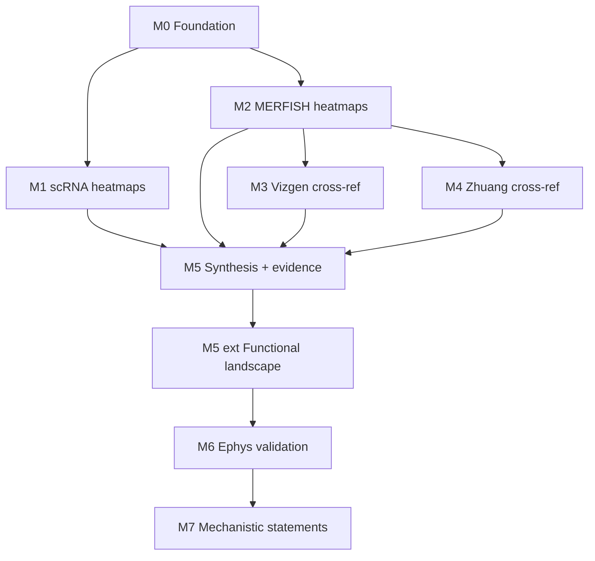

# Expresso — milestones & roadmap

Living map of what has been built, what is in active use, and what comes next.
Last updated: June 2026.

---

## North star

Use openly available transcriptomic and spatial datasets (Allen scRNA, Allen MERFISH,
Vizgen, Zhuang) within the Allen CCF + cell-type taxonomy to **cross-validate**
expression of a curated receptor + excitability gene panel, then support
**functional statements** of the form:

> *Cell type C in region R expresses gene set X, implying intrinsic excitability
> profile … and neuromodulatory influences …*

with explicit confidence tiers, provenance (measured vs imputed), and — in later
milestones — validation against **single-cell electrophysiology**.

Companion references: [`receptor_excitability.md`](receptor_excitability.md),
[`excitability_genes.md`](excitability_genes.md), [`REVIEW.md`](REVIEW.md).

---

## Completed milestones

### M0 — Foundation ✅

| Deliverable | Location |
|-------------|----------|
| Unified config loader | `src/config.py`, `query_config.yaml` |
| ABC Atlas data access (backed h5ad, partial reads) | `src/data_loaders.py` |
| Plotting (heatmaps, cross-ref scatters) | `src/plotting.py` |
| Run folders + git/config manifest | `start_run()`, `run_manifest.json` |
| Smoke test | `scripts/verify_setup.py` |
| Repo guide | `REPOSITORY_GUIDE.md` |

**Key design choices:** config-driven genes/regions; timestamped runs outside the
repo; memory-safe MERFISH imputed reads; nested `gene_panel` (category → family → genes).

---

### M1 — Allen scRNA heatmaps ✅

**Notebook:** `notebooks/01_scrna_heatmaps.ipynb`

- Mean log2(CPM+1) per cell type × brain area (pooled VIS dissection ROIs)
- Per-family and combined heatmaps
- Output: `aggregated_scrna.parquet` (`mean_expression`, `frac_expressing`, `n_cells`)

**Limitation (by design):** scRNA cannot resolve VISp vs VISpm; fine-region claims
require spatial datasets (M2–M4).

---

### M2 — Allen MERFISH heatmaps ✅

**Notebook:** `notebooks/02_merfish_spatial.ipynb`

- Native CCF sub-region resolution (VISp, VISpm, VISam, RSPagl, …)
- Measured ~500-gene panel + optional **imputed** ~8k matrix (`use_imputed_merfish`)
- Output: `aggregated_merfish.parquet`
- **Fix (2026-06):** row-first h5ad slice for imputed matrix (avoids multi-hour hangs on 47 GB file)

---

### M3 — Vizgen cross-reference ✅

**Notebook:** `notebooks/03_vizgen_crossref.ipynb`

- kNN label transfer (z-scored) from Allen MERFISH → Vizgen cells
- Spearman-first concordance vs Allen; measured-only metrics
- Full-library CPM normalization (not receptor-subset denominator)
- Output: `aggregated_vizgen.parquet`, cross-ref figures
- **Depends on:** M2 `aggregated_merfish.parquet` for label transfer

---

### M4 — Zhuang cross-reference ✅

**Notebook:** `notebooks/04_zhuang_crossref.ipynb`

- Replicate-averaged Zhuang MERFISH (~1,122 genes)
- Spearman concordance vs Allen MERFISH
- Output: `aggregated_zhuang.parquet`, cross-ref figures
- **Depends on:** M2 for Allen reference aggregates

---

### M5 — Cross-dataset synthesis ✅

**Notebook:** `notebooks/05_synthesis.ipynb`  
**Module:** `src/synthesis.py`

| Step | What it does |
|------|----------------|
| Aggregate discovery | Auto-find newest `aggregated_*.parquet` per dataset from run folder names |
| Evidence table | One row per `(cell_type, brain_area, gene)` with per-dataset means, detection, provenance |
| Confidence tiers | **High** = ≥2 independent measured datasets; **medium** = 1 measured (+ imputed support); **low/none** otherwise |
| Independence model | Allen MERFISH imputed values are *supporting only* (not independent of scRNA) |
| Target reports | Batch export under `targets/{cell_type}__{region}/` (CSVs, statement, family PDF) |
| Global outputs | `evidence_table.parquet` / `.csv`, `targets/_index.csv` |

**Run order:** M1 + M2 in parallel → M3 + M4 (need M2) → M5 (needs all four aggregates).

---

### M5 extension — Functional landscape ✅ *(implemented inside notebook 05)*

**Module:** `src/functional_analysis.py`  
**Config:** `functional_analysis:` block in `query_config.yaml`

Goes beyond inventory to **mechanism-oriented grouping**:

| Feature | Description |
|---------|-------------|
| Functional modules | Resonance axes (H-resonance, M-resonance, INaP amplifier, …) + coupling-centric neuromodulator axes (Gi/Gq/Gs) |
| Targets | `(supertype, brain_area)` — sourced from run folders at `functional_analysis.cell_type_level`, independent of main synthesis level |
| Expression picker | Spatial priority: MERFISH → Vizgen → Zhuang → scRNA; high/medium tier only |
| Module scores | Z-scored gene means per module per target |
| Clustering | Hierarchical clustering on module-score vectors |
| Joint embedding | PCA (or UMAP) over resonance + neuromod modules |
| VISp vs V2M contrast | Per supertype: V2M − VISp module-score deltas (`vis_group_contrast.csv`) |
| Ephys placeholder | Single-cell schema + test fixture; cohort summaries linked to atlas targets |

**Outputs:** `{run_dir}/functional/` — module scores, embedding, dendrogram PDFs, provenance, level source report.

**Test fixture:** [`data/test_experimental_resonance.csv`](data/test_experimental_resonance.csv) — **one row per ephys cell** (n≈20 per coarse_type × area); L5 ET / VISp is bimodal (`ET_low` / `ET_high`) to demo within-type heterogeneity.

---

## Operational state (June 2026)

You have production runs at **both supertype and subclass** levels in the exploration
folder. The pipeline handles this explicitly:

- Main synthesis cells use `config.cell_type_level` (currently **subclass** in YAML).
- Functional landscape auto-sources **supertype** runs via folder-name parsing and
  warns if any dataset is missing at that level (`level_source_report.csv`).

**Recommended next execution:**

1. Ensure supertype runs exist for all four datasets (01–04) — scRNA supertype run
   is present; verify MERFISH / Vizgen / Zhuang supertype parquets match functional
   needs.
2. Run M5 through functional landscape cells.
3. Inspect `functional/vis_group_contrast.csv` and joint embedding coloured by
   VISp vs V2M.
4. Within L5 supertypes, check whether `h_resonance_axis` vs `m_resonance_axis`
   scores separate IT-like from ET-like groups.

---

## Future milestones

### M6 — Ephys ↔ expression validation *(next)*

**Goal:** Close the loop between **single-cell resonance recordings** and
**expression-based functional modules** — including subclusters *within* broad types
(e.g. two functional subgroups inside L5 ET).

**Prerequisites (done):**

- Single-cell ephys CSV schema (`cell_id`, `coarse_type`, `brain_area_group`, `peak_resonance_hz`, …)
- `experimental_within_type_summary()` — flags bimodal / multi-hint cohorts
- `link_targets_to_experimental()` — atlas target ↔ ephys cohort summaries (placeholder)
- Test fixture with L5 ET VISp bimodal subclusters

**To build:**

| Task | Notes |
|------|-------|
| Load real ephys CSV | Replace `data/test_experimental_resonance.csv` or set `functional_analysis.experimental_resonance_csv` |
| Ephys clustering | Cluster cells within coarse_type × area on peak Hz, strength, (optional) morpho metadata |
| Expression at matched resolution | Options: (a) pseudobulk module scores for matched Allen supertype; (b) cell-level MERFISH where cell ID mapping exists; (c) deconvolution-weighted bulk |
| Validation metrics | Correlate ephys subcluster centroids with module scores; ARI vs known hints; regression peak_hz ~ resonance modules |
| L5 ET focus | Primary use case: test whether H/M-resonance gene modules split ET_low vs ET_high |
| Reporting | Per-subcluster statement scaffold; uncertainty / n cells |

**Open design questions for M6:**

- Do ephys cells carry Allen `supertype` / `cluster` IDs, or only coarse L5 IT / L5 ET labels?
- Is VISp vs V2M assignment per cell from recording location?
- Should expression comparison use supertype pseudobulk or attempt single-cell MERFISH matching?

---

### M7 — Mechanistic coupling statements *(optional)*

**Goal:** Move from module scores to **pathway-level claims** grounded in
`receptor_excitability.md` (e.g. α2-AR → HCN suppression, M1 → M-current collapse).

| Task | Notes |
|------|-------|
| Effector-chain scoring | Gi receptor module × GIRK/HCN effector module concordance |
| Presynaptic vs postsynaptic | Split receptor tables by compartment where literature supports it |
| Area-specific neuromodulation | VISp vs V2M contrasts on coupling axes |
| Tier weighting | Lift PROMINENT/PLAUSIBLE from `excitability_genes.md` into YAML for prioritization ([REVIEW §3.2 open item]) |

---

### M8 — Reporting & scale *(optional)*

| Task | Notes |
|------|-------|
| Master report PDF | Cross-target summary beyond per-target family PDFs |
| Spatial map revival | Wire `plot_spatial` / `plot_family_spatial_panel` if slice-level figures needed |
| Performance | Cache imputed MERFISH row-slices per cell filter; parallel target export |
| Taxonomy guard | Assert non-empty joins in cross-ref ([REVIEW §5 open item]) |

---

## Open items (from review, not yet scheduled)

| Item | Severity | Ref |
|------|----------|-----|
| PROMINENT/PLAUSIBLE gene tiers in YAML | Enhancement | REVIEW §3.2 |
| `plot_spatial` unused by notebooks | Low | REVIEW §5 |
| Cross-ref taxonomy overlap assertion | Low | REVIEW §5 |
| `top_variable_cell_types` unused | Low | REVIEW §5 |

---

## Milestone dependency graph

---

## Quick reference — key artifacts

| Artifact | Milestone | Path pattern |
|----------|-----------|--------------|
| `aggregated_scrna.parquet` | M1 | `{timestamp}_{level}_WMB-10Xv3/` |
| `aggregated_merfish.parquet` | M2 | `{timestamp}_{level}_MERFISH-*/` |
| `aggregated_vizgen.parquet` | M3 | `{timestamp}_{level}_Vizgen-MERFISH/` |
| `aggregated_zhuang.parquet` | M4 | `{timestamp}_{level}_Zhuang-ABCA/` |
| `evidence_table.parquet` | M5 | `{timestamp}_{level}_synthesis/` |
| `targets/` report tree | M5 | `.../synthesis/targets/` |
| `functional/` landscape | M5 ext | `.../synthesis/functional/` |
| Ephys test fixture | M6 prep | `data/test_experimental_resonance.csv` |

Run folder naming: `{YYYYMMDD}_{HHMMSS}_{cell_type_level}_{dataset_slug}` under
`output.output_dir`.

---

## Where we are / where we are going

**Done:** A reproducible, config-driven pipeline from raw atlas data through
cross-validated evidence tables, per-target report packs, and an initial
**functional landscape** (resonance + neuromodulator module scores, clustering,
VISp–V2M contrasts). Scientific correctness fixes from the full review are
implemented (Vizgen CPM, Spearman cross-ref, kNN scaling, imputed provenance,
fraction expressing, synthesis tiers).

**Now:** Run the stack at the taxonomy level(s) you care about (supertype for
functional analysis; subclass or supertype for synthesis reports). Explore whether
expression module space recapitulates known L5 IT vs L5 ET biology and VISp vs V2M
area differences.

**Next (M6):** Replace the test ephys fixture with real single-cell recordings;
cluster within coarse types; statistically link resonance subclusters to expression
modules — the step needed to support claims like *"this L5 ET subgroup has high
H-resonance module score and ~6 Hz peak impedance"* with both omics and ephys evidence.
